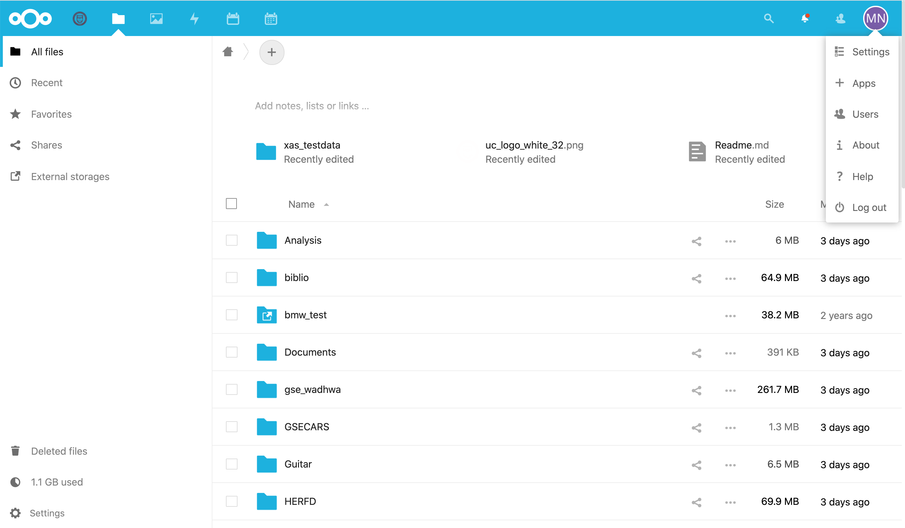
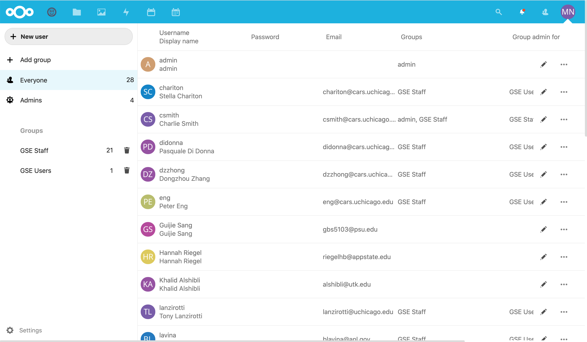
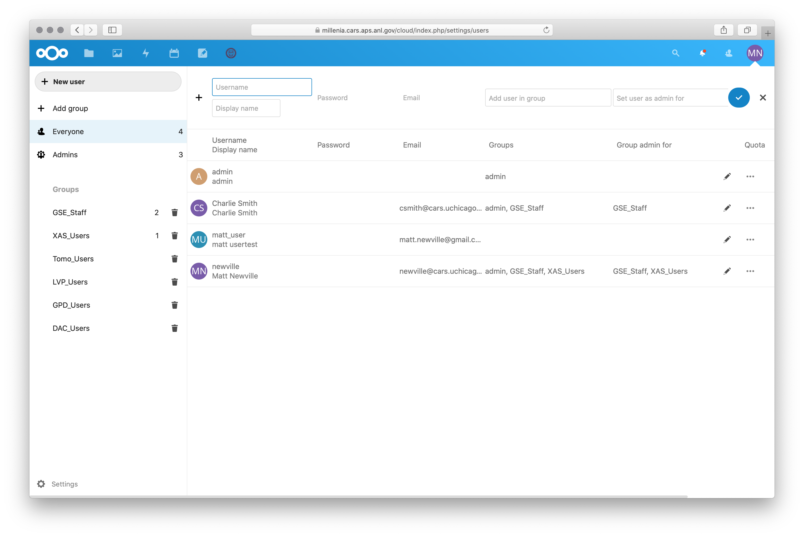
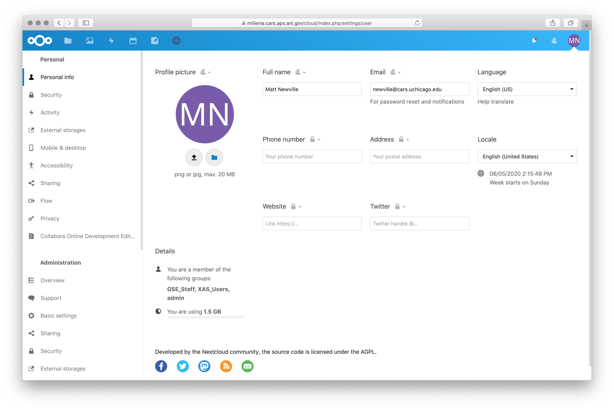
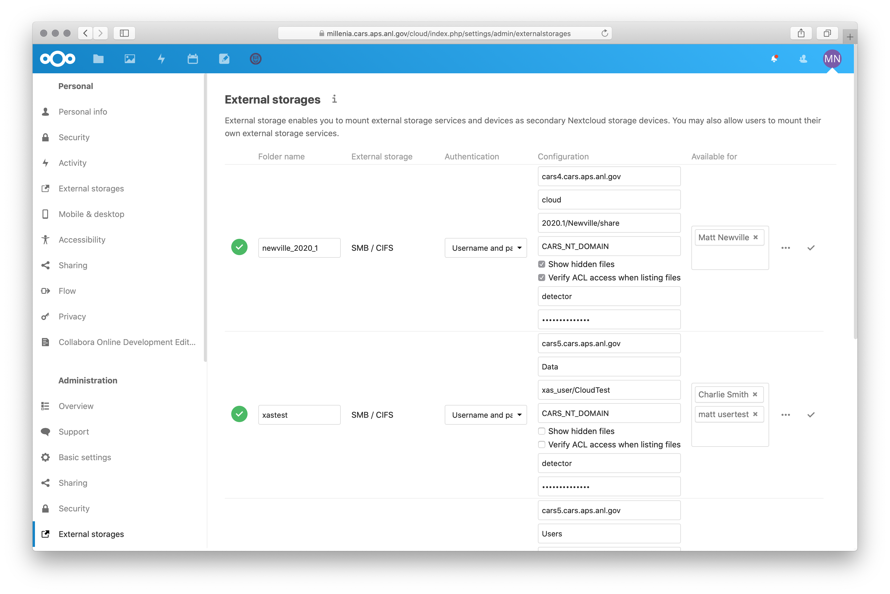
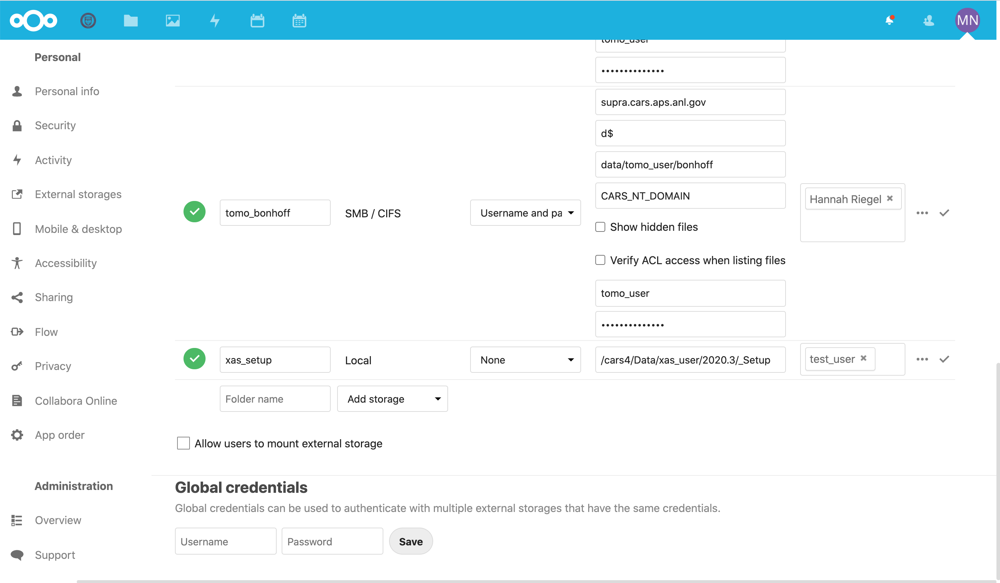
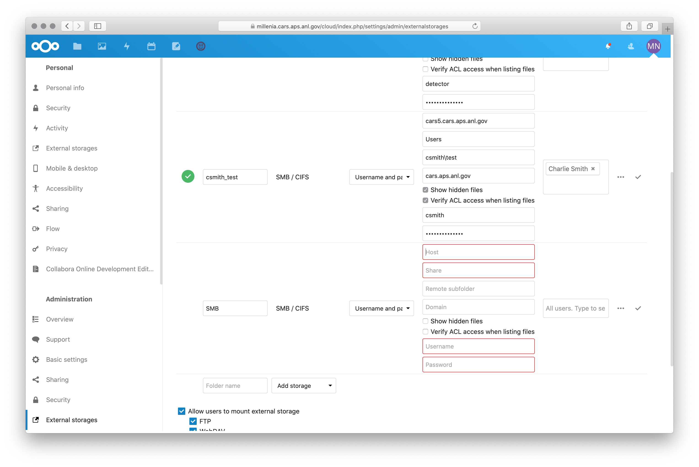
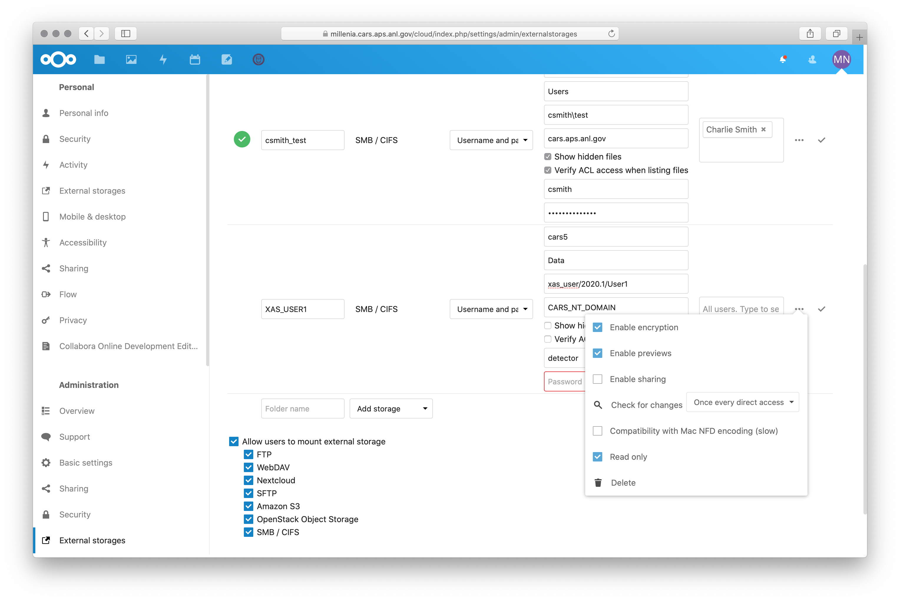

For Beamline Staff: Sharing GSECARS Data
==========================================================

Using Nextcloud to share data with remote users is meant to replace users
copying data to USB drives. It has the advantage of working well for remote
users, but also copies data continuously as the data is being collected so
that there does not need to be one big copy of all the data after it is
collected.  You can set up an account for a user and start sharing data
from a particular folder on the GSECARS data arrays before the users'
beamtime begins or after it has begun.

All of the information about logging in, installing clients, and connecting
to files in the User documentation applies to GSE Staff.  In addition,
staff members that are in the `Admin` group can create user accounts,
create shares to the GSECARS data directories on cars5, and share those
folders with user accounts.   If you are not in the `Admin` group but would
like to be, ask Matt or Charlie.

Creating User Account
-------------------------------------------------

.. Note::

   The Nextcloud accounts are *completely separate* from the
   CARS_NT_DOMAIN accounts.

Logged in as an user with `Admin` or `GSE Staff` privileges, you can click
on your user icon on upper right (this will be your initials or you can add
an image):

.. _staff_fig1:

    Staff Login Page, with Drop-down

We'll show the **Settings** page in the next section.  To see all the
current users and create a new user, select **Users** from the Drop-down
list which will take you to a page like this:

.. _staff_fig2:

    List of Users

From here, you can select `+ New User` which adds a row at the top to
fill in the username and email address.

.. _staff_fig3:

    Creating a New User

Clicking the check mark will send an invitation email to the user to get
them started using Nextcloud.  You can set an initial password for the
user, but we recommend leaving the password field empty as this will force
the user to set a password as the are setting up their account.

.. note::

   When creating a user account, leave the password field empty.

Creating a Share to cars5/Data
-----------------------------------------

This is how you set which data folder is shared with a particular user.
Please read these instructions carefully, and don't hestitate to ask Matt
or Charlie if you have questions.

Use the **Settings** Dropdown menu from your account icon to bring up
your account page.  Here you can change your name, image, etc, and the
"Security" link on the left-hand column will let you change your
password or set up 2-factor authentication.

.. _staff_fig4:

    Staff Settings Page, for people with Admin privileges.

If you are logged in with an **Admin** account (as all GSECARS staff
should be), you have Administrator rights for the site.

.. note::

   Really, you have full admin privileges for this site.  Be careful and
   please don't change things except as described here.  If you have
   questions, ask Matt or Charlie.

At the bottom left of the page, under "Administration" label, there is a
link labeled "External storages".  Note that there will be an "External
storages" under the "Personal" label: that is the one for the shares used
by your account, and you need to select the one under the "Administration"
label.  Clicking on that "Administration External storages" link will show
this:

.. _staff_fig5:

    Add External Storage Page

(If you see something different, make sure you got the right "External
storages" link).  You will have to scroll to the bottom of the page, and
then select the "Add Storage" menu and select "SMB/CIFS"

.. _staff_fig6:

    Add External Storage Page: Select "SMB/CIFS" from the "Add storage"
    menu.

When that is displayed, you will see a form where you can set the name of
the shared folder, and entries for the SMB connection:

.. _staff_fig7:

    Add External Storage Page: Setting the "SMB/CIFS" Options

With this small form, you will need to set the following values:

* for **Host**, you should set `cars5.cars.aps.anl.gov` (except for
  `xas_user` data, which uses `cars4`).

* for **Share** you should select `Data_RO`.  This is a Read-only version
  for access to the `T:/` drive (`cars5/Data`).  The software does allow
  you to select the `Data` or `Users` share (or any other shared folder
  from the `CARS_NT_DOMAIN`), but be careful that these would normally
  mounted as read/write for the `CARS_NT_DOMAIN` username that you select.
  At this, please be very careful in sharing Shares other than `Data_RO`.

* for **Remote Subfolder** you should select the actual user folder for the
  beamline datat that you want to share.  This is relative to the `T:/`
  drive (or whatever Share you selected), so should be something like
  `dac_user/2020/IDD_2020-1/USERNAME`,
  `lvp_user/data/13-ID-D/2020/Mar20/USERNAME`, or
  `gpd_user/data/idc/2020/run2/USERNAME`.  Note that this will mean that
  only that folder (and anything in it) will be shared -- so pick the
  folder for the users' beamtime, not all of `cars5/Data/dac_user`!

* for **Domain**, use `CARS_NT_DOMAIN` or `CARS.APS.ANL.GOV`.

* For **Username** and **Password**, select a valid user that can read (and
  perhaps write) to the folder you are sharing.  For mounting `Data_RO`,
  that could either be the appropriate `XXX_user` account that can read
  that folder, or the `detector` or `epics` account which can read all of
  the `Data_RO` share.

* In the **Available for** column, you will get a dropdown menu of Users known
  to `Nextcloud`.   Select the user account(s) that you would like to share
  this data folder -- probably the account you just created.

* Finally, if you have selected a folder on a share that is *not* set up to
  be read only (such as the recommended `Data_RO`), you should use the
  ellipses icon (`...`) and check the "Read only" box.  Note that if you
  share a folder with read/write permissions, the user will be able to move
  and delete data on this share from their remote connection.

.. _staff_fig8:

    Make sure that the External Storage is set to be Read Only.

.. Note::

   Really: make sure tha data folder is Read only!  Otherwise the user will
   be able to really delete the data on `cars5` from their home computer.

If you have any questions about this, don't hesitate to ask Matt or
Charlie.   These are powerful tools!
