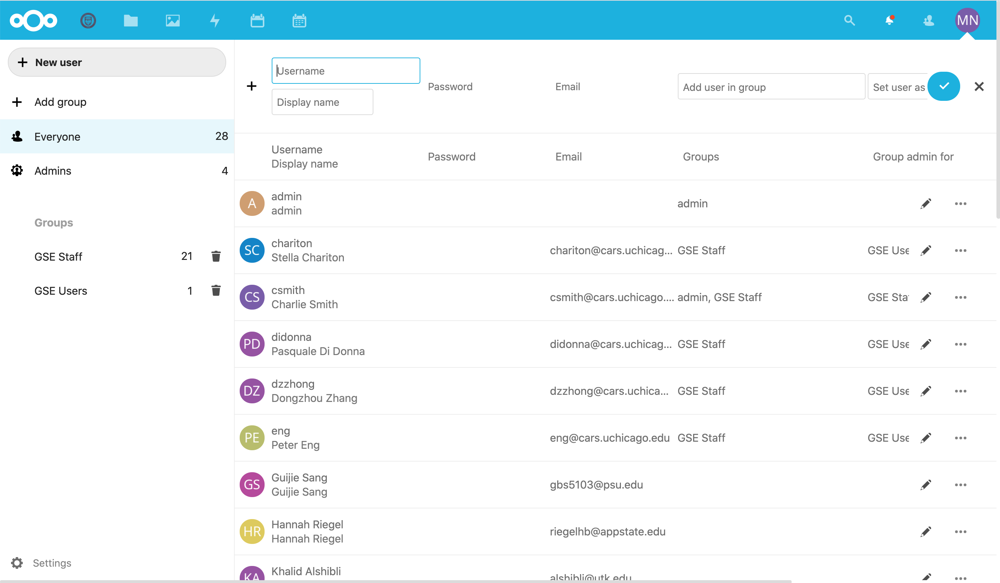
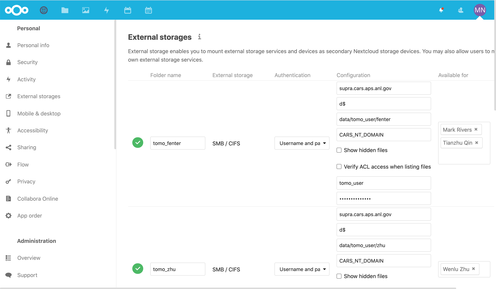

For Staff: Sharing CARS Data
==========================================================

Using Nextcloud to share data with remote users is meant to replace the
process of copying user data to USB drives. It has the advantage of working
well for remote users, but also copies data continuously as the data is
being collected so that there does not need to be one big copy of all the
data after it is collected.  You can set up an account for a user and start
sharing data from a particular folder on the CARS data arrays before the
users' beamtime begins or after it has begun.

All of the information about logging in, installing clients, and connecting
to files in the User documentation applies to the Staff as well.  In
addition, staff members that are in the `Admin` group can create user
accounts, create shares to the data directories on cars5 or other folders
on our network, and share those folders with user accounts.  If you are not
in the `Admin` group but would like to be, ask Matt or Charlie.

Using Nextcloud 
------------------------------

As mentioned in the :ref:`User section of this document <users_doc>`,
Nextcloud provides a cloud-service for synchronizing data across multiple
clients.  The Nextcloud web client has many add-ons for calendars, viewing
Office files, and so on.  These can be useful, but the main feature is that
files are synchronized across multiple clients.

For the "normal files" in your Nextcloud folder (that is, not including the
external data files that actually sit on CARS5/Data or other CARS data
servers), there are no arbitrary data or usage limits and the data is
really hosted on the CARS web-server (millenia.cars.aps.anl.gov).  There is
about 3Tb of space on this server, and the data is backed-up daily.  It
turns out that the Nextcloud data uses a fairly transparent layout so that
we should be able to restore files that have been accidently deleted or
overwritten.

Creating User Account
-------------------------------------------------

.. Note::

   The Nextcloud accounts are *completely separate* from the
   CARS_NT_DOMAIN accounts.

Logged in as an user in the `Admin` or `GSE Staff` group, you can click on
your user icon on upper right (this will be your initials or you can add an
image):

.. _staff_fig1:

.. figure::  _images/StaffUserSettings_Dropdown.png
    :target: _images/StaffUserSettings_Dropdown.png
    :width: 85%
    :align: center

    Staff Login Page, with Drop-down

We'll show the **Settings** page in the next section.  To see all the
current users and create a new user, select **Users** from the Drop-down
list which will take you to a page like this:

.. _staff_fig2:

    List of Users

From here, you can select `+ New User` which adds a row at the top to
fill in the username and email address.

.. _staff_fig3:

    Creating a New User

Clicking the check mark will send an invitation email to the user to get
them started using Nextcloud.  You can set an initial password for the
user, but we recommend leaving the password field empty as this will force
the user to set a password as the are setting up their account.

.. note::

   When creating a user account, leave the password field empty.

Creating a Share to cars5/Data
-----------------------------------------

CARS Staff members who are in the Nextcloud Admin group can set up shares
to beamline data folders to share with a particular user.  At this point,
most staff member are not in the Admin group, so if you would like to share
beamline data with a user, contact Matt, Charlie, or Mark.  If you think
you will be doing this on a regular basis and would like to be in the Admin
group, that is definitely possible.  If you have other questions about
sharing data with users, don't hesitate to ask.

The file sharing is most naturally based on Folders - a complete folder
(and all subfolders) is shared and synchronized on the remote machine.  If
you want to share *some* of the beamline data with users, but not all of
it, the easiest thing to do is to set up a subfolder and share only that.
With this approach, the beamline staff could copy or move files into the
subfolder shared with the user as they want.  You can, for example, share
all of the data from a user run with yourself and a student, but only share
a subfolder with selected results and processed files with other
collaborators.

The easiest way to get to the page to configure "External Storages" is by
going to
https://millenia.cars.aps.anl.gov/cloud/index.php/settings/admin/externalstorages

You can also browse to it from the **Settings** Dropdown menu from your
account icon to bring up your account page.  At the bottom left of the
page, under "Administration" label, there is a link labeled "External
storages".  Note that there will be an "External storages" under the
"Personal" label: that is the one for the shares used by your account, and
you need to select the one under the "Administration" label.  Clicking on
that "Administration External storages" link will take to
https://millenia.cars.aps.anl.gov/cloud/index.php/settings/admin/externalstorages
and show a page like this:

.. _staff_fig5:

    Add External Storage Page

This will show a list of the currently active external shares.  Browsing to
the bottom of that page, you will see an "Add Storage" menu:

.. _staff_fig6:

    Add External Storage Page: Select "Local" or "SMB/CIFS" from the "Add
    storage" menu, then give that share a name and add users who should
    have access to that data.

From here you can add either **Local** storage to a share that is already
mounted from millenia, or select **SMB/CIFS** to share data from any of the
shares available in the CARS Windows domain. Note that there are other
options too, but most of these are not actually configured.

Most of the shares for user data will be to ``/cars5/Data`` or
``/cars4/Data``, which are already mounted as "Local", so you can just give
the full path to the folder to share, such as::

     /cars5/Data/dac_user/2020/IDD_2020-2/CARS/

Give that folder a name (preferrably following the convetion of
`lvp_username`, `dac_username`, etc just so we can all keep them
organized),then select from the dropdown list which users to share with,
and click the Checkmark.  If it all works, the icon on the left will be a
green checkmark, and if there is a problem (like, the share does not exist
or was mispelled), it will show as a red exclamation point.  Note that
millenia mounts these shares as Read-only so the beamline data cannot be
erased or changed by the remote users share of the data.

.. _staff_fig7:

    Add "Local" External Storage by giving the address starting with
    `/cars5/Data/...`,  `/cars5/Users/...`, or `/cars4/Data/...`.

.. note::

   If sharing data from /cars5/Data, using 'Local' is the easiest as safest
   method.

To set up a share with SMB/CIFS, you will see a form where you can set the
name of the shared folder, and entries for the SMB connection:

.. _staff_fig8:

.. figure::  _images/StaffAddStorage_SMB.png
    :target: _images/StaffAddStorage_SMB.png
    :width: 85%
    :align: center

    Add External Storage Page: Setting the "SMB/CIFS" Options

With this small form, you will need to set the following values:

* for **Host**, you should set `cars5.cars.aps.anl.gov` (except for
  `xas_user` data, which uses `cars4`).

* for **Share** you should select `Data_RO`.  This is a Read-only version
  for access to the `T:/` drive (`cars5/Data`).  The software does allow
  you to select the `Data` or `Users` share (or any other shared folder
  from the `CARS_NT_DOMAIN`), but be careful that these would normally
  mounted as read/write for the `CARS_NT_DOMAIN` username that you select.
  At this, please be very careful in sharing Shares other than `Data_RO`.

* for **Remote Subfolder** you should select the actual user folder for the
  beamline datat that you want to share.  This is relative to the `T:/`
  drive (or whatever Share you selected), so should be something like
  `dac_user/2020/IDD_2020-1/USERNAME`,
  `lvp_user/data/13-ID-D/2020/Mar20/USERNAME`, or
  `gpd_user/data/idc/2020/run2/USERNAME`.  Note that this will mean that
  only that folder (and anything in it) will be shared -- so pick the
  folder for the users' beamtime, not all of `cars5/Data/dac_user`!

* for **Domain**, use `CARS_NT_DOMAIN` or `CARS.APS.ANL.GOV`.

* For **Username** and **Password**, select a valid user that can read (and
  perhaps write) to the folder you are sharing.  For mounting `Data_RO`,
  that could either be the appropriate `XXX_user` account that can read
  that folder, or the `detector` or `epics` account which can read all of
  the `Data_RO` share.

* In the **Available for** column, you will get a dropdown menu of Users known
  to `Nextcloud`.   Select the user account(s) that you would like to share
  this data folder -- probably the account you just created.

* Finally, if you have selected a folder on a share that is *not* set up to
  be read only (such as the recommended `Data_RO`), you should use the
  ellipses icon (`...`) and check the "Read only" box.  Note that if you
  share a folder with read/write permissions, the user will be able to move
  and delete data on this share from their remote connection.

.. _staff_fig9:

.. figure::  _images/StaffAddStorage_ReadOnly.png
    :target: _images/StaffAddStorage_ReadOnly.png
    :width: 85%
    :align: center

    Make sure that the External Storage is set to be Read Only.

.. Note::

   Really: make sure tha data folder is Read only!  Otherwise the user will
   be able to really delete the data on `cars5` from their home computer.

If you have any questions about this, don't hesitate to ask Matt or
Charlie. These are powerful tools!
