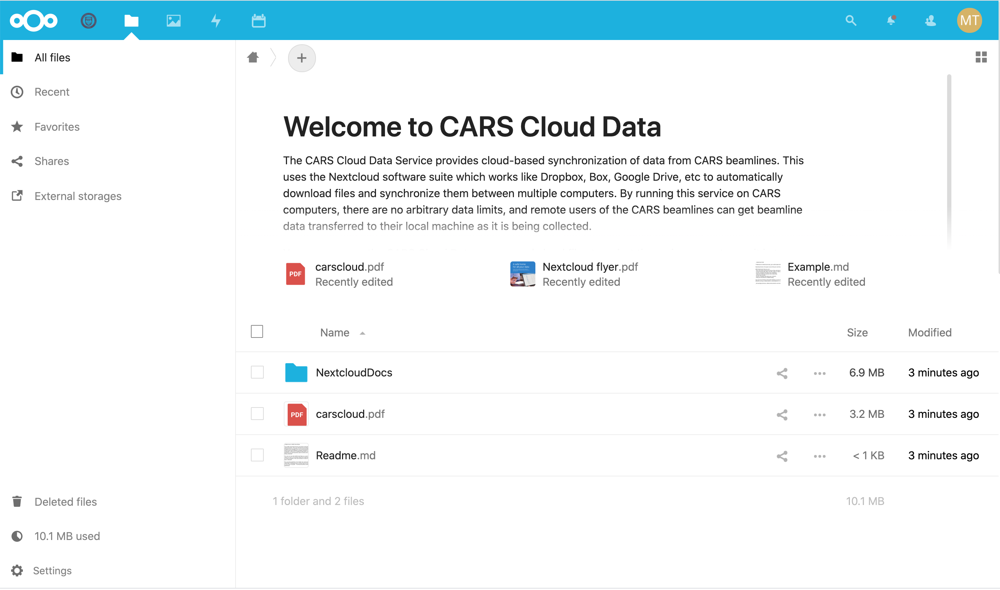

.. |settings_icon| image:: _static/settings.png
                   :height: 25px

.. |gse_icon| image:: _static/gse_logo.ico
               :height: 20px

For Beamline Users: Accessing GSECARS Data
==============================================================

What is GSECARS Cloud Data?
----------------------------------------------

The `GSECARS Cloud Data Service <https://millenia.cars.aps.anl.gov/cloud>`_
gives users of the GSECARS beamlines access to the data collected at
GSECARS using a cloud-based synchronization tool similar to Dropbox, Box,
Google Drive.  That is, data files will be sent automatically from specific
folders on the GSECARS data collection servers to your remote machine as
the data is being collected.  Depending on the speed of your internet
connection and the speed of data collection at the beamline, files should
show up within a few minutes of being collected.

The GSECARS Cloud Data service uses the `Nextcloud
<https://nextcloud.com>`_ software which we run on our own servers at
GSECARS.  This means that the data will be transferred from our data
collection servers directly to you without any other servers being
involved.  This means that we don't need to put any limits on the amount of
data transferred, but it also gives us control about who we share the data
with.  If you have any concerns about the security of your data using this
service, please contact us.

Getting Access
----------------------------------------------

To get access to the GSECARS Cloud Data, you will receive an email from the
email address **Nextcloud <cloud_admin@millenia.cars.aps.anl.gov>** with the
subject line of **Your Nextcloud account was created** telling you that your
account was created and giving you links to both set your password and
install the client application.

Follow the **set your password** link to finish creating your account. The
login and data transfer is encrypted, but please use a good password that
is not one that you use for other important sites.

If you have not received such an email and would like access to the GSECARS
Cloud Data, please ask your beamline scientist and they should be able to
help you get access.

The web client
----------------------------------------------

Logging in to the `GSECARS Cloud Data Service
<https://millenia.cars.aps.anl.gov/cloud>`_, you will see a screen
that looks something like this:

.. _user_fig1:

    Basic view of the GSECARS Cloud Data

On the top Blue menu, you will a File Folder icon showing your files.  You
will see other icons too, including a U. Chicago logo |gse_icon| that leads
to this document.  In the upper right corner you will see a round icon with
the initials of your user name from which you can get to your user settings
(including changing your password) or log out.

In the File view, you will see a few documentation files for Nextcloud and
standard folders for Documents and Photos.  You should see a folder icon
with a arrow in it: |external_folder_icon|. In the example above this
folder is called `xastest` but in your folder it will have a name related
to your data collection (and may be the last name of the PI for the beam
time).  The arrow indicates that it is really a link to our data collection
servers, and this folder is where the beamline data will be found.

From this web interface, you can download any individual file.  Like other
file-sharing apps, Nextcloud has many additional features. There are
note-taking apps, you can create links for any file to be able to share
selected files with others, and so forth. You may some of these features
useful, but the main point is to automatically transfer your data from the
GSE beamline data acquisition systems to your computers.

Using WebDav: View remote files
--------------------------------------------------------

From the settings icon  |settings_icon| in the lower left, you will see a
link for WebDAV, an address that will be something like
`https://millenia.cars.aps.anl.gov/cloud/remote.php/dav/files/USERNAME`.
You can use this address to mount your Nextcloud data folder with your
operating systems file explorer.

On Microsoft Windows, you can use the **Map Network Drive** feature of
Explorer and enter this address.  On MacOS, you can use **Connect to
Server** (at the bottom of the **Go** menu in Finder) Finder.  Linux users
can mount this with **davs://millenia....** from the Gnome Command Center
or using their desktop folder of choice.

This gives you access to the files on the GSECARS server from your
computer, but it does not automatically copy the files to your local
machine.  Each time you open a file, it will be read over the network.

The Nextcloud App: syncing data
--------------------------------------------------------

In order to automatically synchronize data from GSECARS to your local
machine, you will need to download and install the Nextcloud client
application.  These are available for all major operating systems
(including mobile devices) at
https://nextcloud.com/install/#install-clients

When you install and run this, you do not need to "Register with a
provider", but you do need to "Log in" and provide the server address which is::

      https://millenia.cars.aps.anl.gov/cloud

The use of `https` here is important: `http` will not work.  Clicking
"Next" should bring up your web browser with an interface to log in (if you
have not already logged in) and then "Connect to your account" and finally
"Grant access".

Once your account is connected, a folder -- probably called "Nextcloud" in
your home folder -- will be created and start to synchronize with the files
on the GSECARS servers.

It is important to note that the files in the beamline data folder is read
only.  That is, you will not be able to delete or move data on the beamline
server.  As a consequence, you should treat this folder as a snapshot of
the beamline data.

.. Note::

   For best performance and to avoid repeated copying, do not move, delete,
   or reorganize data within the beamline data folder until your beamtime
   is complete and the sharing is turned off.

If you want to start processing your data, please treat this beamline
folder as the source of data from which you copy file to your own
workspace.

For X-ray microprobe users
~~~~~~~~~~~~~~~~~~~~~~~~~~~~~~~~~~~~~~

The warning above to treat the `nextcloud` folder as a source for data is
especially true for X-ray microprobe Map files, which are `HDF5` files that
may be continually updated as the data collected.  The GSECARS MapViewer
application will also try to write to these HDF5 map files and this can
corrupt the files.

Please avoid opening the Map HDF5 files directly from the Nextcloud
folder!!  Copy them to a separate working directory and use them there.

Cleaning up your data
-------------------------------------------------

The `Nextcloud` folder on your local machine will remain synchronized
with the GSECARS location as long as we keep that share alive and as
long as you run the Nextcloud application (and point it to that
folder).  We intend to keep these shares alive during your data
collection and for a few weeks after that.

.. Note::

   Please make a copy of the data in your Nextcloud folder
   when your beam time is over!

Although GSECARS retains your data, we don't keep it where it was collected
-- our fastest and most robust disk servers.  At the end of each run cycle,
we will move your data from the folder we originally shared with you.  We
will also stop sharing data with you at this point.  The data will stay in
your `Nextcloud` folder but you should also copy the data because if you
return for beamtime and we share a *different* folder with you for your
next run, it will remove and replace the data on your local `Nextcloud`
folder.  If this does happen, we can help restore lost original data, but
we hope we don't have to do this very often.
