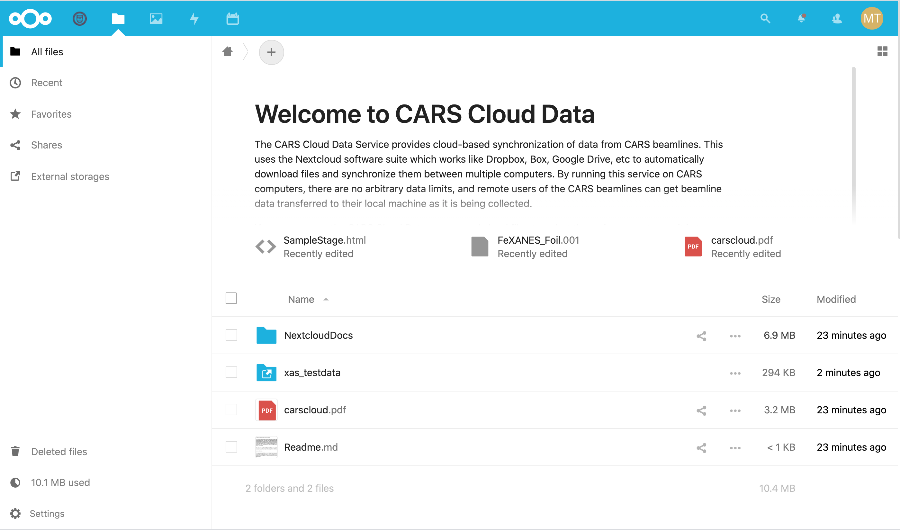

.. |external_folder_icon| image:: _static/folder-external.png
                           :height: 25px

.. _users_doc:

For Users: Accessing CARS Data
==============================================================

What is CARS Cloud Data?
----------------------------------------------

The `CARS Cloud Data Service <https://millenia.cars.aps.anl.gov/cloud>`_
gives users of the CARS beamlines access to the data collected at CARS
using a cloud-based synchronization tool similar to Dropbox, Box, Google
Drive.  That is, data files will be sent automatically from specific
folders on the CARS data collection servers to your remote machine as the
data is being collected.  Depending on the speed of your internet
connection and the speed of data collection at the beamline, files should
show up within a few minutes of being collected.

The CARS Cloud Data service uses the `Nextcloud <https://nextcloud.com>`_
software which we run on our own web server at CARS.  Thie data will be
transferred from our data collection servers directly to your computers,
without any other servers being involved.  This means that we don't need to
put any limits on the amount of data transferred, and also gives us control
about who we share the data with.  If you have any concerns about the
security of your data using this service, please contact us.

Getting Access
----------------------------------------------

To get access to the CARS Cloud Data, you will receive an email from the
email address **Nextcloud <cloud_admin@millenia.cars.aps.anl.gov>** with
the subject line of **Your Nextcloud account was created** telling you that
your account was created and giving you links to both set your password and
install the client application.

This email message will show your user name and give links to **set your
password** and **Install Client**.  Start by following the **set your
password** link to finish creating your account. The login and data
transfer is encrypted, but please use a good password that is not one that
you use for other important sites.  If you have not received such an email
and would like access to the CARS Cloud Data, or would like other people
in your group to get access to the data, please contact your beamline
scientist and they should be able to help you get access.

Just to be clear, the CARS Nextcloud is not related to any other
accounts from CARS, U Chicago, or ANL, but access is restricted to
legitimate CARS users with real access credentials to the beamline.  That
is, we can share data with CARS users, but if you want to share it with
some other collaborators, we'll leave that up to you.

The web client
----------------------------------------------

Logging in to the `CARS Cloud Data Service
<https://millenia.cars.aps.anl.gov/cloud>`_ for the first time you will see
some introductory pop-up screens, including more links to Install Client
apps, and then you will see a screen that looks something like this:

.. _user_fig1:

    Basic view of the CARS Cloud Data

On the top Blue menu, you will a U. Chicago logo |uchicago_icon| labeled
'CARS Help' that leads to this document, a File Folder icon showing your
files, and a few other icons.  In the upper right corner you will see a
round icon with the initials of your user name from which you can get to
your user settings (including changing your password) or log out.

In the File view, you will see a few documentation files for Nextcloud and
standard folders for Documents and Photos.  You should see a folder icon
with a arrow in it: |external_folder_icon|. In the example above this
folder is called `xas_testdata` but in your folder it will have a name
related to your data collection (probably including the last name of the PI
for the beam time).  The arrow indicates that this folder is really a link
to our data collection servers accessed from our webserver, and not
directly on that webserver itself.

From this web interface, you can download any individual file.  Like other
file-sharing apps, Nextcloud has many additional features. There are
note-taking apps, you can create links for any file to be able to share
selected files with others, and so forth. You may find some of these
features useful, but the main point is to automatically transfer your data
from the beamline data acquisition systems to your computers.

Using WebDav: View remote files
--------------------------------------------------------

From the settings icon  |settings_icon| in the lower left, you will see a
link for WebDAV, an address that will be something like
`https://millenia.cars.aps.anl.gov/cloud/remote.php/dav/files/USERNAME`.
You can use this address to mount your Nextcloud data folder with your
operating systems file explorer.

On Microsoft Windows, you can use the **Map Network Drive** feature of
Explorer and enter this address.  On MacOS, you can use **Connect to
Server** (at the bottom of the **Go** menu in Finder) Finder.  Linux users
can mount this with **davs://millenia....** from the Gnome Command Center
or using their desktop folder of choice.

This gives you access to the files on the CARS server from your
computer, but it does not automatically copy the files to your local
machine.  Each time you open a file, it will be read over the network.

WebDAV with Windows
~~~~~~~~~~~~~~~~~~~~~~

On Windows, there is a setting that limits the maximum size of a file that
can be transferred.  By default, this setting is 500 Mb.  If you're using
the WebDAV client of Windows and see a message like::

   Error 0x800700DF: The file size exceeds the limit allowed and cannot be saved

You increase this maximum file size (but only up to 4 Gb!)  by changing
a Windows Registry setting - you may need Administrator privileges to do
this.  From "Start->Run" or "Cmd" you can run the "regedit" utility.  From
there, search for::

    HKEY_LOCAL_MACHINE\SYSTEM\CurrentControlSet\Services\WebClient\Parameters

Then find `FileSizeLimitInBytes` and click on it to Modify it.  You can
set the value up to 4,294,967,295, then click `OK` and restart your
computer.

The Nextcloud App: syncing data
--------------------------------------------------------

This is the recommended way to fetch your data from CARS.  It is pretty
easy to set up and will automatically and efficiently copy new data
directly from the CARS data collection servers to your local computer.

In order to automatically synchronize data from CARS to your local machine,
you will need to download and install the Nextcloud client application.
These are available for all major operating systems (including mobile
devices) at https://nextcloud.com/install/#install-clients

When you install and run this, you do not need to "Register with a
provider", but you do need to "Log in" and provide the server address which
is::

      https://millenia.cars.aps.anl.gov/cloud

The use of `https` here is important: `http` will not work.  Clicking
"Next" should bring up your web browser with an interface to log in (if you
have not already logged in) and then "Connect to your account" and finally
"Grant access".

Once your account is connected, a folder -- probably called "Nextcloud" in
your home folder -- will be created and start to synchronize with the files
on the CARS servers.   There will also be a Nextcloud app that you can
access (usually from the Toolbar or from your normal File Browser) to check
activity and refine settings such as which folders to sub-folders
synchronize and set files to optionally ignore.

.. Note::

   If you have trouble downloading files larger than 500 Mb, check the
   Settings in your Nextcloud client application and make sure this
   suggested default value is not selected.

How to use your CARS Cloud Data Share
~~~~~~~~~~~~~~~~~~~~~~~~~~~~~~~~~~~~~~~~~~

The files in the top-level Nextcloud folder work just like other cloud
services: updating a file in the Nextcloud folder on your local computer
will push those changes "to the cloud" (that is, back to the CARS
webserver) and any other folder tied to that account will soon see those
changes. You can install the client app on multiple machines to synchronize
files across them all.

The files in the "live beamline data folder" (marked with
|external_folder_icon|) are shared with you as "read only". You can delete
or move files in this folder, but those changes will *not* be pushed back
to the beamline server. It is a good idea to think of the files in this
folder as a snapshot of the files at the beamline.

We have a few tips and suggestions for working effectively with these data
files as they are being collected.  First, as data is being collected, you
can always make a copy of the data from "live beamline data" folder to
another folder or to your own backup drive.

Nextcloud uses the **timestamps** of files on the server to decide which
files need to be fetched, and it will look for conflicts between the
"local" and the "server" versions of the file. This has a few consequences.

#. If a file on the beamline data server is partially written or gets
   updated, the changed file *will* be pushed to your local computer.  Such
   an update can cause large-ish files to be sent more than once, but
   ensures you have the latest version.

#. If you delete a file from your local folder and it does not change on
   the server it will not be re-copied unless you explicitly ask to re-sync
   (which you can do from the Nextcloud app).

#. If you have modified a file locally and it *also* changes on the
   server, the Nextcloud app will warn you that there is a conflict, and
   you might end up with two copies of the file: `file.dat` as exists on
   the server and `file (conflicted...).dat` as was modified locally.

For X-ray microprobe users working with XRF maps, and for GPD Users, this
last point may be especially important as the data files for "XRF Maps"
(ID-E user) and "spec files" and "Data Shell" (ID-C users) are largish
files that may be automatically updated on the beamline-side as the data is
being collected but that you may also want to use on your own computer.
For the XRF Maps and "Data Shell" files that use the "HDF5" format
(typically with the extension `.h5`), this can be particularly noticeable
as these files can become corrupted if two processes write to them.

That is, if you are processing live data files for `GSE MapViewer` (ID-E
users) or `Data Shell` (ID-C users) as the data are coming in, you may see
corrupted HDF5.  If this happens, you can simply delete the broken file and
re-sync the file from the beamline server.  Note that this will lose any
changes you made to the file.  For microprobe users, this will include
"saved positions" or "named areas" which you will have to recreate.

Cleaning up your data
-------------------------------------------------

The `Nextcloud` folder on your local machine will remain synchronized
with the CARS location as long as we keep that share alive and as
long as you run the Nextcloud application (and point it to that
folder).  We intend to keep these shares alive during your data
collection and for a few weeks after that.

.. Note::

   Please make a copy of the data in your Nextcloud folder
   when your beam time is over!

Although we will keep your data, we don't keep it where it was collected --
our fastest and most robust disk servers.  At the end of each run cycle, we
will move your data from the folder we originally shared with you.  We will
also stop sharing data with you at this point.  The data will stay in your
`Nextcloud` folder but you should also copy the data because if you return
for beamtime and we share a *different* folder with you for your next run,
it will remove and replace the data on your local `Nextcloud` folder.  If
this does happen, we can help restore lost original data, but we hope we
don't have to do this very often.
